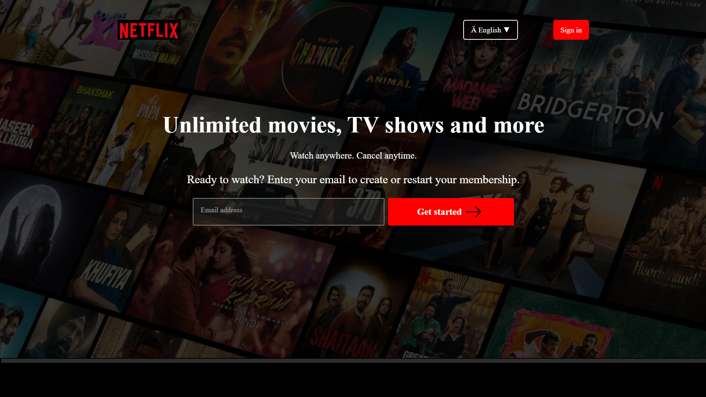

# Netflix UI Clone

🔴 A clone of the Netflix landing page built using **HTML + CSS + JavaScript**

---

## 🔧 Features

- ✅ Fully responsive design (mobile, tablet, desktop)
- ✅ Netflix-style layout and font weights
- ✅ Custom toast notifications for buttons and FAQs
- ✅ Interactive UI with modern hover effects
- ✅ Lightweight – no frameworks or libraries used
- ✅ Styled with pure CSS and CSS animations
- ✅ Sectional layout (Hero, Device Support, Downloads, Kids, FAQ, Footer)

---

## 🛠️ Tech Stack

- HTML5  
- CSS3  
- Vanilla JavaScript (for toast interactivity)

---

## Demo
[Live on GitHub Pages](https://shivam97d.github.io/Netflix-Clone//)

---

## Screenshots

---

## 💡 How to Use

1. Clone the repository:
 
2.Open index.html in your browser OR
Deploy to GitHub Pages.

---

## Author
Shivam Dahifale – [LinkedIn](https://linkedin.com/in/shivam-dahifale-018040238)
